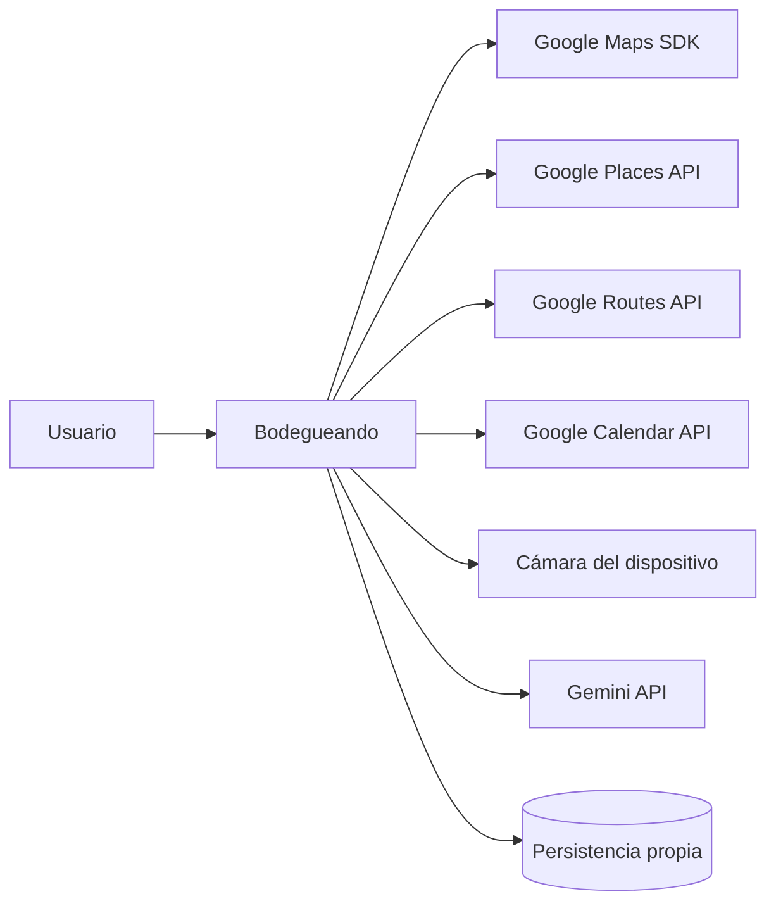
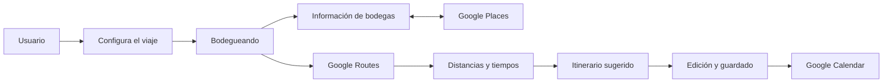
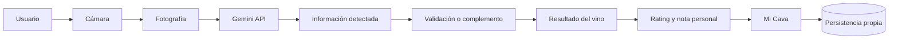

# APIs e integraciones

Este documento identifica las APIs, los SDKs y las capacidades externas necesarias para implementar el MVP de Bodegueando. Describe responsabilidades conceptuales, no código, credenciales, endpoints propios ni una arquitectura técnica definitiva.

## Clasificación general

- **APIs externas:** Google Routes API, Google Places API, Google Calendar API y Gemini API.
- **SDKs externos:** Google Maps SDK correspondiente a la plataforma móvil que se elija.
- **Capacidades nativas:** cámara y, opcionalmente para el MVP, geolocalización del dispositivo.
- **Servicios propios por definir:** persistencia, backend y autenticación.
- **Integraciones futuras:** disponibilidad, reservas, pagos y sistemas externos de bodegas.

## 1. Google Maps Platform

Google Maps Platform soporta tres necesidades diferentes del producto: visualizar mapas, consultar lugares y calcular recorridos. Estas responsabilidades no deben tratarse como una única función.

### Maps SDK

El Maps SDK de la plataforma móvil elegida permite mostrar mapas interactivos dentro de la aplicación.

#### Uso en Bodegueando

- Mostrar bodegas en un mapa.
- Mostrar la ubicación de una bodega en su detalle.
- Representar marcadores de bodegas.
- Mostrar las paradas de un itinerario.
- Representar visualmente una ruta bodeguera.
- Alternar entre vistas de lista y mapa.

El Maps SDK resuelve la **visualización**. No es, por sí solo, la lógica que calcula distancias, tiempos, recorridos ni recomendaciones.

### Consideraciones

- La variante concreta del SDK depende del framework y las plataformas móviles que se definan.
- Las pantallas deben contemplar carga y error del mapa.
- La implementación deberá respetar los requisitos vigentes de atribución y uso de Google Maps Platform.

## 2. Google Routes API

Google Routes API aporta información de movilidad entre bodegas.

### Uso en Bodegueando

- Calcular la distancia entre dos bodegas.
- Obtener tiempos estimados de viaje.
- Calcular recorridos con varias paradas.
- Aportar datos para ordenar las visitas de manera lógica.
- Mostrar distancias y tiempos de traslado dentro del itinerario.

Ejemplo de representación:

```text
Bodega A
  ↓ 24 min — 18 km
Bodega B
  ↓ 31 min — 25 km
Bodega C
```

La información geográfica puede utilizarse tanto para presentar el itinerario como para comprobar que una propuesta sea razonable.

### Límite de responsabilidad

Google Routes no determina qué bodegas son las mejores para un usuario. La selección de bodegas, la ponderación de preferencias, el rating, el presupuesto y la generación de recomendaciones pertenecen a Bodegueando. Routes aporta recorridos, distancias y tiempos.

### Consideraciones

- Los resultados deben manejar estados de error o indisponibilidad.
- La forma de ordenar múltiples paradas debe definirse junto con la estrategia de recomendación de Bodegueando.
- El uso, almacenamiento y representación de resultados debe cumplir las condiciones vigentes de Google Maps Platform.

## 3. Google Places API

Google Places API puede funcionar como fuente de búsqueda e información geográfica de lugares reales.

### Uso en Bodegueando

- Buscar bodegas o lugares.
- Autocompletar búsquedas geográficas.
- Obtener coordenadas y direcciones.
- Consultar información pública disponible sobre una bodega.
- Relacionar la ficha propia de una bodega con su lugar correspondiente en Google Maps.

### Datos potencialmente provenientes de Google Places

- Identificador del lugar en Google.
- Nombre.
- Dirección.
- Coordenadas y ubicación.
- Fotografías disponibles.
- Otra información pública ofrecida por el servicio.

Que un dato esté disponible en Places no implica automáticamente que deba copiarse o almacenarse de forma permanente. La implementación deberá revisar las condiciones de uso, almacenamiento, actualización y atribución vigentes. El identificador de lugar puede servir como vínculo entre el registro propio y Google Places.

### Datos propios de Bodegueando

- Identidad y ficha canónica que Bodegueando decida mantener para cada bodega.
- Información propia sobre experiencias y vinos destacados.
- Ratings y reseñas publicados dentro de Bodegueando.
- Relaciones con rutas creadas por usuarios.
- Favoritos.
- Información editorial o específica incorporada al sistema.

### Separación de ratings

Un rating externo de Google y el rating público creado por usuarios de Bodegueando son fuentes diferentes. No deben mezclarse en un único promedio ni presentarse sin identificar su origen.

### Estrategia conceptual de datos

Bodegueando necesita mantener sus relaciones y contenido propio en su persistencia. Los datos externos pueden consultarse para complementar o actualizar información geográfica, siempre conforme a las políticas del proveedor. Queda pendiente definir qué campos serán propios, cuáles se consultarán bajo demanda y cómo se resolverán actualizaciones o discrepancias.

## 4. Google Calendar API

Google Calendar permite exportar un itinerario guardado al calendario conectado por el usuario.

### Uso en Bodegueando

Al seleccionar **“Agregar itinerario a Google Calendar”**, la aplicación crea un evento independiente por cada visita planificada.

Cada evento puede incluir:

- Nombre de la bodega.
- Fecha.
- Hora de inicio.
- Hora estimada de finalización.
- Dirección.
- Descripción básica de la experiencia.
- Enlace a la bodega.
- Enlace externo para reservar, si existe.

Ejemplo:

```text
Visita — Bodega Catena Zapata
Fecha: 14 de octubre
Horario: 10:00–12:00
Ubicación: dirección de la bodega
```

### Regla de producto

Agregar una visita a Google Calendar **no significa que exista una reserva confirmada**. Bodegueando está calendarizando una visita planificada.

### Autorización y estados

El usuario deberá autorizar el acceso necesario a Google Calendar. La experiencia debe contemplar:

- Calendar desconectado.
- Solicitud de conexión o autorización.
- Calendar conectado.
- Confirmación previa a crear los eventos.
- Sincronización exitosa.
- Error de sincronización y posibilidad de reintentar.

## 5. Cámara del dispositivo

La cámara es una capacidad nativa del teléfono, no una API externa.

### Uso en Bodegueando

```text
Usuario toca “Escanear”
→ la aplicación solicita permiso si corresponde
→ abre la cámara
→ el usuario toma una fotografía
→ la aplicación obtiene la imagen
→ envía la imagen al servicio de identificación
```

### Permiso de cámara

Antes de solicitar acceso, la aplicación debe explicar que necesita la cámara para identificar vinos mediante fotografías de sus etiquetas.

La interfaz debe contemplar:

- Permiso todavía no solicitado.
- Permiso concedido.
- Permiso denegado y orientación para recuperarlo.
- Error de captura.

## 6. Gemini API para identificación de vinos

Gemini API es el servicio multimodal propuesto para analizar la fotografía de una etiqueta.

### Objetivo

Intentar detectar información visible como:

- Nombre del vino.
- Bodega.
- Varietal.
- Añada.
- Región.

### Flujo conceptual

```text
Cámara
→ imagen de la etiqueta
→ Gemini API
→ información detectada
→ búsqueda o validación del vino
→ resultado de identificación
```

### Límite de responsabilidad

El modelo de visión no debe considerarse necesariamente la fuente definitiva de toda la información. Su función principal puede ser extraer o inferir datos visibles de la etiqueta. Bodegueando puede validar y complementar el resultado con datos propios u otra fuente que se defina posteriormente.

La respuesta del modelo debe tratarse como un resultado con incertidumbre. Si no existe certeza suficiente, la aplicación muestra **“Vino no identificado”** y permite:

- Reintentar la fotografía.
- Buscar manualmente.

El modelo específico de Gemini y la estrategia de validación quedan pendientes de decisión técnica.

## 7. Base de datos propia

Bodegueando necesita persistencia propia aunque la tecnología todavía no esté elegida.

### Usuarios

- Cuenta.
- Perfil.
- Preferencias.

### Bodegas

- Información propia.
- Vinculación con el lugar externo cuando corresponda.
- Relaciones con rutas.
- Rating interno.

### Reseñas

- Usuario.
- Bodega.
- Rating público.
- Comentario.
- Fotos opcionales.

### Rutas

- Usuario.
- Fechas.
- Bodegas.
- Orden de visitas.
- Horarios.

### Mi Cava

- Usuario.
- Vino.
- Rating personal.
- Nota personal.

### Favoritos

- Usuario.
- Bodegas guardadas.
- Vinos guardados, si se confirma que “favorito” será un concepto diferente de guardar un vino en Mi Cava.

No se define en esta instancia un motor de base de datos, proveedor de almacenamiento ni diseño detallado de datos.

## 8. Autenticación

Bodegueando requiere autenticación para asociar información persistente a cada persona.

### Acciones que requieren una cuenta

- Guardar rutas.
- Usar Mi Cava.
- Guardar favoritos.
- Publicar reseñas.
- Sincronizar Google Calendar.
- Mantener preferencias.

### Capacidades necesarias

- Registro.
- Login.
- Manejo de sesión.
- Recuperación de contraseña.
- Autenticación u OAuth con Google si se implementa Google Login.
- Autorización de Google independiente y adecuada para acceder a Calendar.

No se selecciona automáticamente Firebase Authentication ni otro proveedor. El sistema de autenticación continúa como decisión técnica pendiente.

## 9. Geolocalización del dispositivo

La ubicación del teléfono es una capacidad nativa que puede complementar la exploración.

### Posibles usos

- Mostrar bodegas cercanas.
- Calcular distancia desde la posición actual.
- Centrar el mapa en el usuario.
- Identificar bodegas próximas durante el viaje.

### Alcance

La geolocalización es **opcional para el MVP**, porque no resulta imprescindible para los userflows principales definidos. Si se incorpora, requerirá permiso de ubicación y estados para permiso denegado o posición no disponible.

## Resumen de integraciones del MVP

| Tecnología o integración | Uso en Bodegueando | MVP |
|---|---|---|
| Google Maps / Maps SDK | Mostrar mapas, bodegas y rutas | Sí |
| Google Routes API | Calcular distancias, tiempos y recorridos entre bodegas | Sí |
| Google Places API | Buscar lugares y obtener información geográfica de bodegas | Sí |
| Google Calendar API | Agregar el itinerario al calendario | Sí |
| Cámara del dispositivo | Fotografiar etiquetas | Sí |
| Gemini API | Analizar e identificar datos visibles de un vino desde una imagen | Sí |
| Persistencia propia | Guardar usuarios, bodegas, reseñas, rutas, Mi Cava y favoritos | Sí |
| Sistema de autenticación | Gestionar cuentas, sesiones y recuperación | Sí, proveedor pendiente |
| Geolocalización | Usar posición actual y mostrar bodegas cercanas | Opcional |
| API de reservas | Reservar bodegas | No |
| Pasarela de pagos | Procesar pagos | No |

## Diagrama conceptual de integraciones



### Flujo de una ruta



### Flujo de identificación de un vino



## Integraciones opcionales o futuras

Fuera del MVP quedan:

- Consulta obligatoria de disponibilidad en tiempo real.
- Reserva automática de bodegas.
- Pasarelas de pago.
- Cancelaciones y reembolsos.
- Integración operativa con sistemas internos de bodegas.
- Fuentes adicionales de información detallada de vinos, hasta que se elija una.

## Decisiones técnicas pendientes

Estas decisiones no se resuelven en este documento:

- Framework mobile.
- Plataformas móviles y variante correspondiente de cada SDK.
- Backend.
- Base de datos.
- Sistema de autenticación.
- Inclusión o no de Apple Login.
- Fuente principal de información de las bodegas.
- Fuente de información detallada de vinos.
- Estrategia exacta para generar recomendaciones.
- Forma de combinar datos propios con datos de Google Places.
- Política concreta de actualización, almacenamiento y atribución de datos externos.
- Modelo específico de IA utilizado para identificar vinos.
- Umbral o estrategia para considerar confiable una identificación.
- Distinción entre un vino favorito y un vino guardado en Mi Cava.

## Referencias oficiales

- [Google Maps Platform](https://developers.google.com/maps/documentation)
- [Políticas y atribuciones de Routes API](https://developers.google.com/maps/documentation/routes/policies)
- [Place IDs](https://developers.google.com/maps/documentation/places/web-service/place-id)
- [Creación de eventos con Google Calendar API](https://developers.google.com/workspace/calendar/api/guides/create-events)
- [Comprensión de imágenes con Gemini API](https://ai.google.dev/gemini-api/docs/image-understanding)
